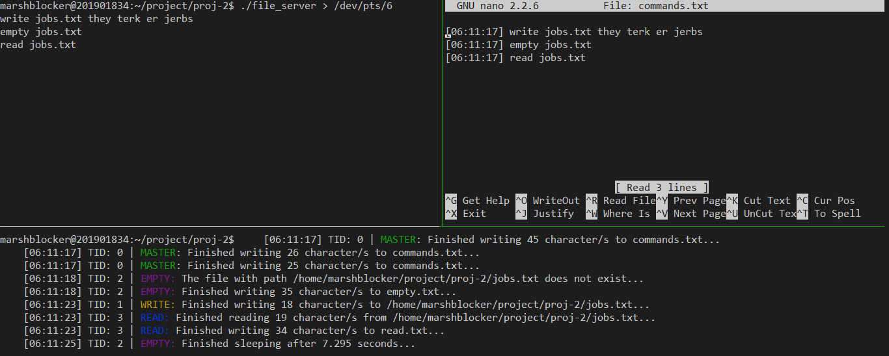

# QuickServer

A fast multi-threaded file server that can handle user input and file operations asynchronously. 
The available file operations are `write`, `read`, and `empty`. This supports both absolute and relative
path.

## Preview



## How to Build

file_server.c is stable given the following (personal) environment:<br>
    - OS/Kernel: Ubuntu 14.04.6 LTS (GNU/Linux 4.4.0-142-generic i686) <br>
    - Compiler: gcc version 4.8.4. <br>
    - Processor: Multi-core <br>
    
 Execute `make clean && make` to compile the program.
 
 ## How to Use
 
 During the execution of the program, you can do the following:
 
 * Create a new file `foo.txt` in the current directory:
 ```
 write foo.txt
 ```
 
 * Append to a file `foo.txt` in the root directory:
 ```
 write bar.txt /
 ```
 
 * Read the content of `foo.txt`. 
 ```
 read foo.txt
 ```
 The read content is automatically stored in the file `read.txt`.
 
 * Clear the content of `foo.txt` found in the upper directory:
 ```
 empty ./../foo.txt
 ```
 The cleared content is automatically stored in the file `empty.txt`.
 
 * Run multiple commands in parallel without concurrency issues:
 ```
 write foo.txt
 read foo.txt
 empty foo.txt
 ```
 
 In addition, the current session's command history is saved in the file `commands.txt`.
 
 
